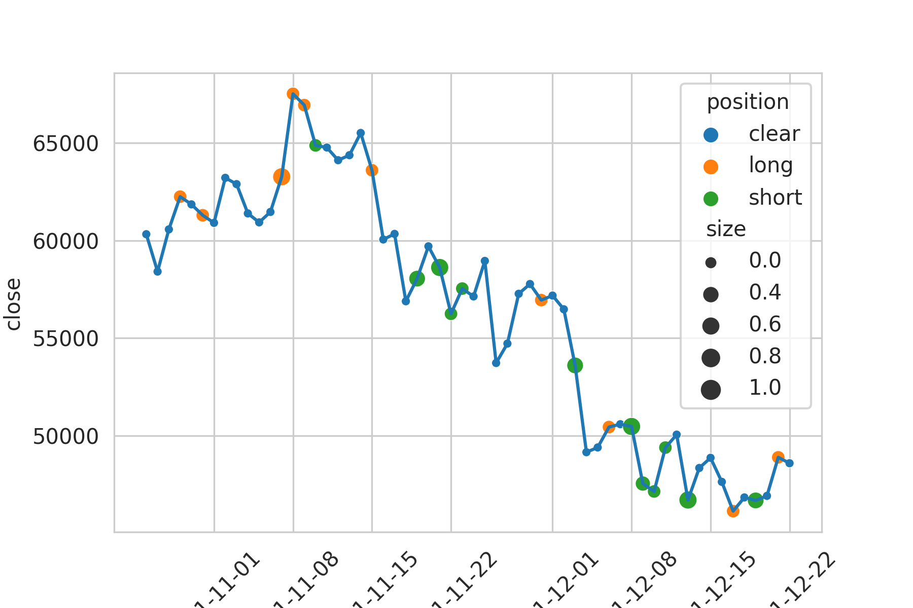

# Risk-aware RL using rainbow IQN

## Table of contents
* [Project Overview](#Project-Overview)
* [Usage](#Usage)
* [Data Exploration](#Data-Exloration)
* [Methodology](#Methodology)
* [Results](#Results)
* [Conclusion](#Conclusion)

### Blog post is available at [here](https://medium.com/@jsrimr2/risk-aware-crypto-trading-agent-using-rainbow-iqn-b208a735384d)

### Visualization of Trading result on 3X leverage Trading Env.



## Project Overview : Generate high-frequency crypto trading program via Reinforcenment Learning

Problem Statement: Gain high earnings from leverage trading.

Using Leverage incurs higher lisk than spot trading. As a result, risk-aware algorithm is needed.
I will use [IQN algorithm](https://arxiv.org/abs/1806.06923) to better cope with those risks.

Metrics:
Return rate

Simulate trading on test data out of the training data time and measure the return rate.


## Usage

Train
```
python train_leverage.py --data_path=binance_futures_1d_train.db 
```

Test
```
python test.py --data_path=binance_futures_1d_test.db --load_file=saves/2021-12-31-01:14:16/IQN_leverage_1200.pth
```

To change the risk-preference, change the RISK_AVERSE
in default_hyperparameters.py

## Requirements
you can check libraries we used at [requirments](requirements.txt)

## Data Exploration
We use daily bitcoin OHLCV (open-high-low-close-volume) data starting ranging 2017-01-01~2021-12-30

For more information, please refer to [data exploration notebook](exploration.ipynb).

We learned that volume data and price data have different scales.
However, price columns (open-high-low-close) have similar scales.

So, we normlize data in two ways. Normalize volume data by volume data and 
Normalize price data by price data.
To be specific, 

lines from [model.py](DQNTradingAgent/model.py) :L139~L140
```
state[:,:,:volume_axis] /= state[:,0,open_axis].reshape(bs,1,1)
            state[:,:,volume_axis] /= state[:,0,volume_axis].reshape(bs,1,1)
```


## Methodology

Implementation

    Model
    : Attention Model + RL (IQN)

    Input : N time-series BTC ohlcv (N * 5)
    Output : Decision (-100% short to 100% long)


    Environment
    : 3X Leverage Env


    Hyperparameters
    : learning_rate
    : tau (how sensitive model cope with the risk)


[Attention](https://arxiv.org/abs/1706.03762), which is now so famous with Transformer model is known to show good performance on time-series data.

[IQN](https://arxiv.org/abs/1806.06923) is an distributional Reinforcement Algorithm which is basically value-based model. However, IQN is different from classical DQN in that it predicts the value of the actions in distributional manner rather than point estimation manner. Also, IQN learns the distribution by qunatile manner which allows it to act differently to the risk when we control the hyperparameter $\tau$.


## Results

### Yield on test data

1. Base line strategy : Buy & hold

Test Yield : 26.6% yield on average
[0.19, 0.26, -1.09, 1.38, 0.80, 0.23, 0.15, 0.54, 1.23, -1.05]

```
python test_baseline.py --data_path=binance_futures_1d_test.db
```

2. Experimental Strategy : IQN

Test Yield :  205.3% yield on average
[-0.68, 0.19, 3.74, 6.83, 1.90, 2.31, 3.26, 1.82, 0.68, 0.45]

```
python test.py --data_path=binance_futures_1d_test.db --load_file=saves/IQN_1d/IQN_leverage_1200.pth
```


## Conclusion

### Reflection
We can see that our strategy outperformed baseline strategy.
However, it still suffered from liquidation which is a deadly harmful risk from using leverage.
It needs more tunings if it were to put in real usage.


### Further work
[ ] Use multiple assets at the same time rather than trade bitcoin only